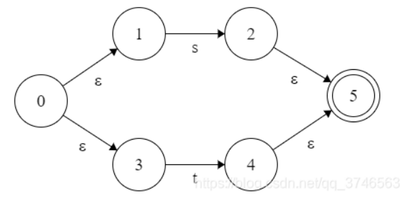
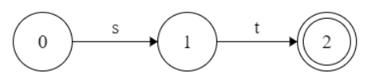
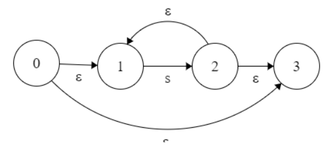
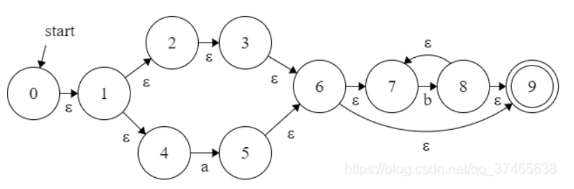
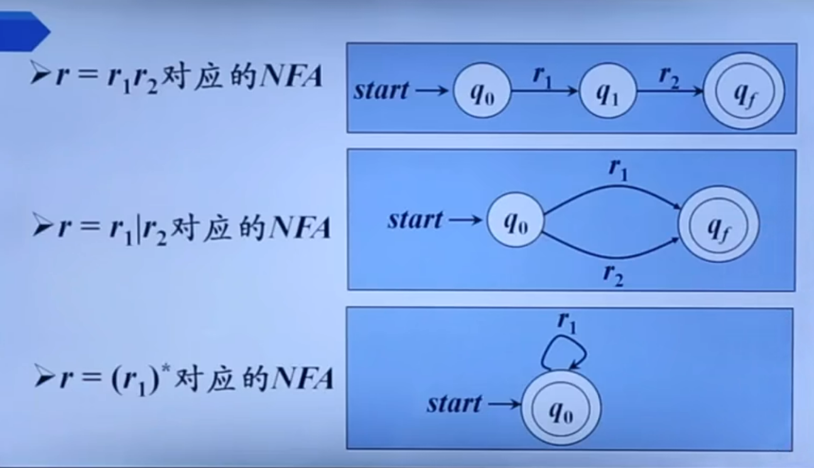
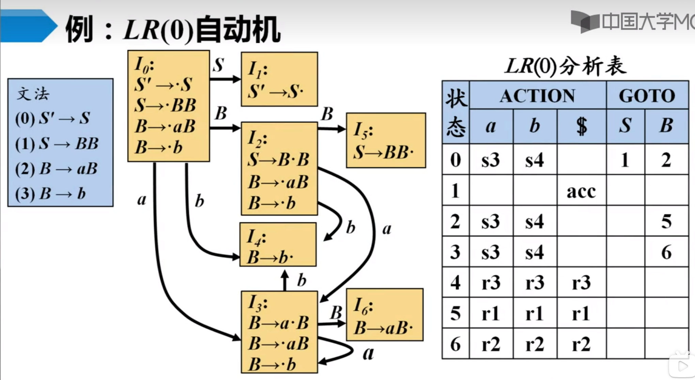

# NFA的画法
NFA其实核心就是三种状态
1. 第一种：  

   - r=s|t  
     
   - r=st  
    
   - r=s*  
    
   - 例：r=(ϵ|a)b*  
    
1. 第二种：

# 从NFA到DFA的转换
DFA中的每一个状态都是由NFA中若干个状态组成的集合
1. 求出 ε_closure(0) 
ε_closure(s)表示由状态s经由条件ε可以到达的所有状态的集合
1. 求出ε_closure(move(A,a))
   设A状态为 ε_closure(0)
   move(A,a)代表从状态A，经过a到达的状态，新状态设为B，以此类推
2. 重复上述步骤直至所有状态经过所有条件所得结果均已知，画出DFA图。
# First集和follow集
## first集
- FIRST(A)集合是​==A能推出的，所有的，第一个的，终结符 或 ε==所组成的集合
- First集规则（相应字母在->左边，查找->右边第一个东西）

1. A->aB，a加进First（A）；
（->右边第一个是终结符，加进集合）

1. A->ε，ε加进First（A）；

2. A->Xa,将集合First(X)\ε加入First（A）中。
（->右边第一个是非终结符，将该非终结符的First集（去空）加进集合）
## follow集
- FOLLOW(A)集合是​所有==紧跟A之后的终结符或$符==所组成的集合（dollar符是句尾的标志），称FOLLOW(A)是A的随符集
- Follow集合规则（相应字母在->右边，查找相应字母的右边的东西）

1. A是开始符号，Follow（A）有$；

2. B->Aa，Follow（A）有a
（后面是终结符，加进我的Follow集）

1. B->AC，First（C）\ε加入Follow（A）。
（后面是非终结符，将该非终结符的First集（去空）加进我的Follow集）

1. B->aA或B->aAC，C->ε。将Follow（B）加入Follow（A）
（后面没东西，或者后面有东西，但这个东西可以取空。将->左边字母的Follow集加入我的Follow集）

# LL(1)
- 定义：
    - G是LL(1)的，**当且仅当**G的任意两个具有相同左部的产生式A→α∣β 满足下列条件:
(1)如果α、β均不能推导出ε，则FIRST(α)∩FIRST(β)=ϕ
(2)α和β至多有一个能推导出ε
(3)如果α→ε，则FIRST(α)∩FOLLOW(A)=ϕ
​
- 构造LL(1)预测分析表
1. 首先算出First集和Follow集
2. 算出每个式子->右边式子的first集
    - first(αA)={α};
    - first(A+B)=first(A);
3. 设表为Table，有t(A,α)
   - 对于一个式子B->β，若first(β)=α，把这个式子添加进t(B,α)  
  **（看箭头右边的first集，若非ε，就把(箭头左边，first集中的终结符)这个空填上这个式子）**
   - 若first(β)=ε，则看follow集，follow(B)=α，把这个式子添加进t(B,α)  
  **（若为ε,就把(箭头左边，箭头左边的follow集中的终结符)这个空填上这个式子）**
- 判断：
  如果分析表中每个空中的产生式少于两个（只有一个产生式或空着）则是LL(1)文法。

# LR(0)与SLR(1)
1. 写出增广文法，即增加一句S'->S
2. 算出follow集
3. 写出LR(0)自动机
4. 根据LR(0)自动机构造LR(0)分析表
例：

- 其中，action一栏代表输入终结符时的跳转，Si代表跳转到状态Ii；goto一栏代表输入非终结符时的跳转。
- I1为接受状态，输入$时填写acc。
- I4/I5/I6都是归约状态，ri代表用文法中的第i个产生式进行归约。
5. 分析冲突
   - 移入归约冲突：同一个状态下既可以移入，也可以归约
   - 归约归约冲突：同一个状态下可以用两个不同的产生式进行归约
   - **如果没有冲突，则称给定的文法是LR(0)文法**
6. 构造SLR(1)分析表
- 如果输入符号α属于移进项目的符号，移入
- 如果输入符号α属于归约项目Bi->βi·中Bi的follow集follow(Bi),则归约，填入ri
- 如果都属于或都不属于，报错
- **如果在SLR(1)表中没有冲突，则称给定的文法是SLR(1)文法**